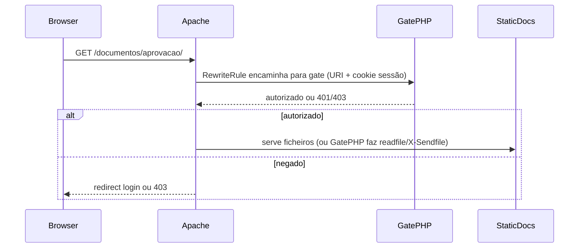

# Plano: login, permissões por documentação e áreas admin-only

## Resposta direta: stack na VPS atual

- **MySQL no aaPanel:** adequado para usuários, papéis, convites, lotes de documentação e (se quiser) tags/tema centralizados. **Não é necessário Postgres** para esses requisitos.
- **Docker/Portainer:** útil para padronizar deploy e escalar serviços, mas **não é pré-requisito**. O que falta hoje não é “container”, é **persistência + sessão + validação no servidor** e **bloqueio de URLs** para arquivos estáticos sensíveis.
- **Caminho de menor atrito no aaPanel:** **PHP 8.x + extensão PDO MySQL** (ou mysqli) com **Apache** do site que o painel gerencia, mais regras **`mod_rewrite`** (e, se necessário, **`.htaccess`** ou snippet no virtual host) para **intercetar** pedidos a `documentos/` e `consulta/` antes de servir ficheiros estáticos — o equivalente ao `auth_request` do Nginx é um **gate em PHP** (validar sessão + path, depois servir ou 403).

Se a equipe preferir **Node** (Express/Fastify) ou **Python**, também funciona no mesmo servidor (Supervisor/PM2 no aaPanel); o desenho de dados e de segurança é o mesmo.

---

## Ambiente local (testar antes da VPS)

**Precisa instalar algo?** Sim, assim que existir **API PHP + MySQL**: o front estático sozinho (por exemplo só o “Live Server” servindo HTML) **não executa** PHP nem fala com o banco. O mínimo útil é **PHP + servidor web + MySQL** na mesma máquina (ou WSL/Docker equivalente).

**XAMPP é adequado:** traz **Apache**, **MariaDB/MySQL** e **PHP**. Após instalar:

- Ativar extensão **PDO MySQL** (em muitos pacotes XAMPP já vem habilitada; conferir `php.ini`: `extension=pdo_mysql` / `extension=mysqli`).
- Colocar o projeto (ou um link simbólico) sob `htdocs`, ou configurar um **virtual host** apontando para a pasta do AutoDocs, para que URLs como `/api/...` e o site fiquem no **mesmo host/porta** (evita dor de cabeça com cookies de sessão e CORS).
- Criar um banco local no phpMyAdmin do XAMPP e um ficheiro de config (ex. credenciais só para dev) que a API PHP leia.

**Paridade local ↔ VPS:** como **aaPanel neste servidor é Apache** e o XAMPP também usa **Apache**, o mesmo desenho (**`mod_rewrite` + gate PHP** para `documentos/` e rotas sensíveis) pode ser testado localmente com o mesmo tipo de configuração (diferindo só host, paths e credenciais da BD).

**Resumo:** instalar **XAMPP (ou Laragon com Apache)** cobre desenvolvimento alinhado ao servidor; não é obrigatório Docker local. Opcional: **Git** para versionar; **Composer** só se passarem a usar dependências PHP.

---

## Estado atual relevante

- Shell e hub: [`scripts/navdrawer.js`](c:\Users\EMPRESARIAL\Desktop\AutoDocsv7\scripts\navdrawer.js) (menu fixo; “Sair” hoje aponta para Google), [`scripts/documentacoes-page.js`](c:\Users\EMPRESARIAL\Desktop\AutoDocsv7\scripts\documentacoes-page.js) (cards a partir de `AUTODOCS_DOCS_CATALOG`).
- Catálogo: [`scripts/autodocs-docs-catalog.js`](c:\Users\EMPRESARIAL\Desktop\AutoDocsv7\scripts\autodocs-docs-catalog.js) — lista de `id` + `href` (inclui `consulta/` e várias pastas em `documentos/`).
- Tags: [`scripts/autodocs-tags-storage.js`](c:\Users\EMPRESARIAL\Desktop\AutoDocsv7\scripts\autodocs-tags-storage.js) — **apenas `localStorage` por navegador**; com vários usuários, isso deixa de ser fonte única de verdade.
- Regra já documentada no repositório: evitar alterar HTML/JS/CSS **dentro** de [`documentos/`](c:\Users\EMPRESARIAL\Desktop\AutoDocsv7\documentos) para o shell — **proteção por Apache (rewrite) + script PHP de gate** atende isso sem editar os geradores de documento (no máximo um **`.htaccess`** na raiz de `documentos/` se não for possível só pelo vhost).

---

## Princípio de segurança (obrigatório)

Filtrar o hub ou o menu **só no JavaScript não protege**: quem souber a URL ainda abre `documentos/aprovacao/` etc.

Fluxo recomendado:

- Em **Apache**: usar **`mod_rewrite`** para prefixos como **`/documentos/`** (e **`/consulta/`** se aplicável) de modo que cada pedido passe por validação antes de servir conteúdo sensível.
- O **gate PHP** valida **cookie de sessão** (httpOnly, Secure, SameSite), carrega o utilizador e verifica se o **caminho** está permitido (mapeamento doc/lote → permissão); se autorizado, **serve o ficheiro estático** (por exemplo `readfile` com path validado, ou **X-Sendfile** se `mod_xsendfile` estiver disponível) para manter performance em JS/CSS do documento.

Sem gate no servidor (só JS no browser), qualquer “login” é só cosmético.

---

## Modelo de dados (MySQL)

Esboço mínimo (ajustar nomes à convenção do projeto):

- **`users`:** id, email, password_hash (argon2id ou bcrypt), `role` (`admin` | `user`), ativo, timestamps.
- **`doc_batches` (lotes):** id, slug (`sofisa`), nome exibido — agrupa várias entradas do catálogo.
- **`doc_batch_items`:** batch_id, `catalog_doc_id` (string alinhada ao `id` em `AUTODOCS_DOCS_CATALOG`, ex. `aprovacao`, `consulta`) **ou** prefixo de path — escolher um critério único para o PHP de auth bater com `REQUEST_URI`.
- **`user_doc_access`:** user_id, batch_id (preferível a N linhas por documento para “atribuir docs do Sofisa” de uma vez) **ou** user_id + catalog_doc_id se lotes forem opcionais.
- **Opcional — convites / cadastro controlado:** tabela `registration_invites` (token, expira, usos) se “cadastro apenas quando acessado” for **cadastro por link secreto**; se for **só admin cria usuário**, nem precisa de página pública de cadastro.

**Interpretação de “cadastro apenas quando acessado”:** no plano técnico convém fechar com o produto uma das opções: (a) URL não listada + token de convite; (b) sem auto-cadastro, só painel admin; (c) primeiro acesso bootstrap. A implementação muda pouco no backend (flag + rota).

---

## Backend (API mínima)

Independentemente de PHP ou Node, endpoints típicos:

| Área | Exemplo | Quem |
|------|---------|------|
| Sessão | `POST /api/auth/login`, `POST /api/auth/logout`, `GET /api/auth/me` | todos autenticados |
| Cadastro | `POST /api/auth/register` | só se política permitir + validação de convite |
| Admin usuários | CRUD usuários + atribuir lotes | `role = admin` |
| Tags (futuro centralizado) | CRUD tags/links | admin (substitui ou sincroniza com localStorage) |
| Tema | opcional: ler/gravar identidade AutoDocs | admin |

- Sessão: **cookie de sessão** + armazenamento server-side (tabela `sessions` ou Redis depois) ou JWT em cookie httpOnly (cuidado com tamanho e revogação).
- Todas as rotas admin: checagem explícita de `role === admin'` (403 se não).

---

## Front-end (ajustes ao shell existente)

- Novas páginas: [`login/`](c:\Users\EMPRESARIAL\Desktop\AutoDocsv7) (e [`cadastro/`](c:\Users\EMPRESARIAL\Desktop\AutoDocsv7) se existir), com formulários que chamam a API; redirect pós-login para painel ou `return_url` validado (whitelist de paths).
- [`scripts/navdrawer.js`](c:\Users\EMPRESARIAL\Desktop\AutoDocsv7\scripts\navdrawer.js): após `GET /api/auth/me`, **ocultar ou desabilitar** itens Designer, Usuários, Tags, Configurações para não-admin; trocar “Sair” para `POST /api/auth/logout` + redirect login. **Manter** a mesma checagem no servidor para quem digitar URL direta.
- [`scripts/documentacoes-page.js`](c:\Users\EMPRESARIAL\Desktop\AutoDocsv7\scripts\documentacoes-page.js): filtrar `AUTODOCS_DOCS_CATALOG` pelos `id` permitidos retornados em `/api/auth/me` (UX); a **fonte autoritativa** continua sendo o **Apache + gate PHP** (e o mesmo para páginas admin se forem protegidas no servidor).
- **Catálogo:** adicionar campo opcional `batchId` ou `batchSlug` por item no JS **ou** manter mapeamento só no MySQL — o importante é que o **gate PHP** use a **mesma chave** que o catálogo usa para decisão.
- Páginas admin ([`usuarios/`](c:\Users\EMPRESARIAL\Desktop\AutoDocsv7\usuarios), [`designer/`](c:\Users\EMPRESARIAL\Desktop\AutoDocsv7\designer), [`tags/`](c:\Users\EMPRESARIAL\Desktop\AutoDocsv7\tags), [`configuracoes/`](c:\Users\EMPRESARIAL\Desktop\AutoDocsv7\configuracoes)): incluir um pequeno **guard** JS que chama `/api/auth/me` e redireciona se não admin (complemento ao bloqueio server-side com **rewrite + gate** nas mesmas rotas, se desejado).

---

## aaPanel (Apache): passos operacionais (alto nível)

1. Criar banco e utilizador MySQL; aplicar migrations (SQL manual ou script).
2. Criar **site** no aaPanel com **Apache**, document root na raiz do AutoDocs; PHP conforme o painel (ex. **php-fpm** ou **lsapi**, conforme a stack do teu aaPanel).
3. Colocar API em subpasta (ex. `/api/`) — evitar expor `.env` e manter `upload_max_filesize` apenas se houver upload.
4. Ativar **`mod_rewrite`** no Apache (e **`AllowOverride All`** no `Directory` do site se usares **`.htaccess`**). Configurar regras para **`/documentos/`** (e **`/consulta/`** se aplicável) que encaminham para o **script gate PHP** (ou documentar o snippet no **“Configuração do Apache”** do site no aaPanel, se preferires não versionar `.htaccess` dentro de `documentos/`).
5. HTTPS, cookie `Secure`, cabeçalhos básicos de segurança.

**Nota:** em alguns servidores o aaPanel instala **OpenLiteSpeed** em vez de Apache; o teu caso é **Apache** — manter o plano alinhado ao que o painel mostra no site (“Apache” vs “OLS”) ao copiar snippets.

---

## Quando faria sentido Docker + Postgres

- Múltiplos ambientes idênticos, CI/CD, ou equipe já padronizada em containers.
- Necessidade de recursos específicos do Postgres ou extensões.
- **Não** é requisito funcional para “login + permissões + admin” neste projeto.

---

## Riscos e decisões

- **Tags e tema em localStorage:** para experiência multiusuário consistente, planejar **fase 2**: persistir tags (e opcionalmente tema) no MySQL e servir via API só para admin/leitura conforme regra de negócio.
- **Manutenção do catálogo:** hoje é um array JS; pode continuar assim com **espelho** em `doc_batch_items`, ou gerar JSON a partir do banco no build — decisão de DX vs fonte única.
- **Performance do gate:** cada pedido a ficheiros em `documentos/` passa pelo PHP (a menos que uses **X-Sendfile** ou cache agressivo); cache em memória da decisão path→permissão e sessões em Redis ajudam em tráfego alto.
