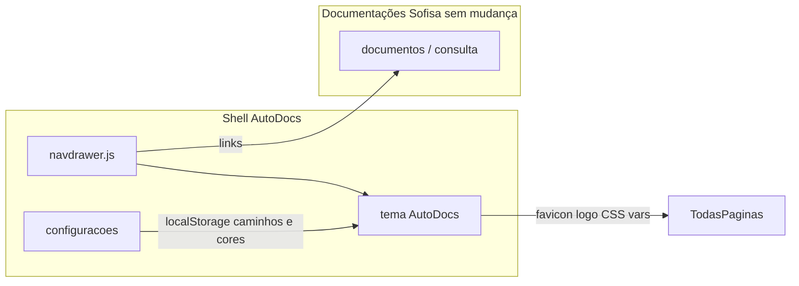

# Plano de implementação — sistema AutoDocs

Este documento descreve o plano aprovado para o shell AutoDocs. A implementação foi realizada conforme as seções abaixo (variáveis CSS em `estilos/sistema.css`, tema em `scripts/navdrawer.js`, hub em `documentacoes/`, páginas `usuarios/`, `designer/`, `suporte/`, formulário em `configuracoes/` e `scripts/configuracoes-autodocs.js`).

## Contexto atual

- O layout global (sidebar, logo, cores) é injetado por `scripts/navdrawer.js` em todas as páginas que já incluem esse script.
- `estilos/sistema.css` define `--cor-destaque`, `--cor-accent` e cores derivadas para o shell.
- `configuracoes/index.html` concentra o formulário da identidade visual AutoDocs.
- **Restrição explícita:** nenhuma alteração dentro de `documentos/` (HTML/JS/CSS das documentações permanecem intactos).

## Abordagem arquitetural

- **Uma única alteração central em `navdrawer.js`** atualiza o menu em todas as rotas (incluindo páginas sob `documentos/`) **sem editar** os arquivos dentro de `documentos/`.
- **Identidade AutoDocs:** aplicar favicon, logo da barra superior e cores via JavaScript no mesmo fluxo que monta o drawer (valores configurados + fallback aos defaults).
- **Persistência inicial:** `localStorage` (`autodocs.logo`, `autodocs.favicon`, `autodocs.corDestaque`, `autodocs.corAccent`). Caminhos são **strings relativos à raiz do site** (ex.: `autodocs/logo.svg`), referenciando arquivos colocados na pasta do projeto (ex.: pasta `autodocs/`).

## Sprint 1 — Variáveis de tema e aplicação global

1. Em `estilos/sistema.css`, uso de `--cor-accent` no lugar de `#006157` fixo, com default `#006157`.
2. Em `scripts/navdrawer.js`, no `DOMContentLoaded`:
   - Ler configuração do `localStorage`.
   - Calcular URL do asset: `basePath + caminhoRelativo` (sanitização: bloquear `..`).
   - Aplicar favicon, `#logo` e variáveis `--cor-destaque` / `--cor-accent` em `:root`.
3. **Fallback:** logo e favicon padrão `sistema/logo.svg`, cores do `:root` no CSS.

## Sprint 2 — Nova navegação lateral (menu AutoDocs)

Menu lateral:

| Seção | Itens |
|-------|--------|
| Principal | Painel Inicial, Documentações, Usuários, Designer, Suporte |
| Inferior | Configurações, Sair do Sistema |

Itens Consulta, documentos individuais e Ajuda foram retirados do menu; o acesso passa pelo hub **Documentações** e pelos atalhos do painel inicial.

Em `scripts/navdrawer.js`:

- **`getBasePath()`:** marcadores incluem `documentacoes/`, `usuarios/`, `designer/`, `suporte/` (além dos existentes para documentos e consulta).
- **`ativarMenu()`:** rotas de configuração e módulos AutoDocs ativam o item correspondente; `documentos/`, `consulta/` e `ajuda/` ativam **Documentações**.

## Sprint 3 — Página “Documentações” (hub)

- Arquivo: `documentacoes/index.html`.
- Grade de cards com links para Consulta e todas as pastas em `documentos/` (espelho dos atalhos do painel inicial).
- Apenas links de entrada — sem alterar conteúdo dentro de `documentos/`.

## Sprint 4 — Páginas vazias

- `usuarios/index.html`, `designer/index.html`, `suporte/index.html` — estado “Em breve”.
- Pasta `ajuda/` permanece sem link no menu.

## Sprint 5 — Configurações da identidade AutoDocs

- `configuracoes/index.html`: formulário com caminhos de logo e favicon, cor de destaque e cor de ênfase (color picker + texto hex).
- `scripts/configuracoes-autodocs.js`: salvar no `localStorage`, chamar `applyAutoDocsTheme()` e recarregar a página.

## Sprint 6 — Metadados na raiz

- `index.html`: título alinhado ao AutoDocs (`Painel Inicial | AutoDocs`).
- Novas páginas usam padrão `<title>… | AutoDocs</title>`.

## Documentação no repositório

- Pasta `docs/` com este arquivo `plano-implementacao-autodocs.md`.

## Futuro (fora do escopo destas sprints)

- Login e níveis de acesso por usuário.
- Upload de arquivo em vez de apenas caminho textual.
- Backend ou arquivo JSON versionado para tema em vez de só `localStorage`.

## Riscos e mitigação

| Risco | Mitigação |
|-------|-----------|
| `file://` e caminhos relativos | `getBasePath()` prefixa assets com a raiz detectada. |
| Favicon não atualiza sem reload | Após salvar, `location.reload()`. |
| Cor quebrar contraste no menu | Defaults preservados; validação de formato hex no tema. |
